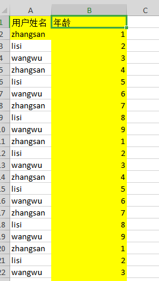
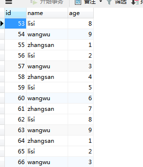

## 参考

[spreadsheet的更多用法范例](https://www.helloweba.net/php/564.html)

### 大量数据的导入和导出

> 问题

    
    数据库连接超时，PHP运行时间超时，内存不够
    
    1. 最近遇到一个问题：数据量不大，
    总共接近4千条，每条数据的字段不超过10个，
    但是数据涉及的表较多，一个sql的查询时间接近1分钟
    拿到的数据不能直接导出，还需要做一些判断和查一些相关的表，尝试多次（解决思路）都是超时
    这里问题的关键还是超时：所有将数据查询和处理，导出分为两个部分，
    第一步，查询出所有的数据处理完之后，存入redis中
    第二步，从redis中拿出数据，导出到excel
    * 遗留问题，当数据逐渐增多时，第一步还是会超时，因为我是一次性查出所有的数据
    
    
    
> 理思路

    set_time_limit(0);
    
    ini_set('memory_limit', '1024M');
    
    $cacheMethod = PHPExcel_CachedObjectStorageFactory:: cache_to_phpTemp;
    $cacheSettings = array(
        'memoryCacheSize' => '8MB',
        'cacheTime' => 600,
    );
    PHPExcel_Settings::setCacheStorageMethod($cacheMethod, $cacheSettings);
    
    -- ob_flush();
    -- flush();

    -- yield

> 解决思路

1. 更换文件格式

    .csv文件的导出
    
[百万数据的导出.csv以及限制和坑](exportMore.php)

[.csv导出的优化](exportMore2.php)

2. 解决查询耗时？？

################################################## 以下是Excel的导出    

## 准备工作

[composer 安装依赖](https://packagist.org/packages/phpoffice/phpspreadsheet)

因为phpoffice/phpexcel停止维护
> This package is abandoned and no longer maintained. The author suggests using the phpoffice/phpspreadsheet package instead.

所以用PhpSpreadsheet
[github地址](https://github.com/PHPOffice/PhpSpreadsheet)

> 1 准备测试数据

    create database if not exists phpexec;

    use phpexec;

    create table if not exists student (
        id int primary key auto_increment,
        name varchar(32) not null default '',
        file1 int not null default 0,
        file2 int not null default 0,
        file3 int not null default 0,
        file4 int not null default 0,
        file5 int not null default 0,
        file6 int not null default 0,
        file7 int not null default 0,
        file8 int not null default 0,
        file9 int not null default 0,
        file10 int not null default 0,
        file11 int not null default 0,
        file12 int not null default 0,
        file13 int not null default 0,
        file14 int not null default 0,
        file15 int not null default 0,
        file16 int not null default 0,
        file17 int not null default 0,
        file18 int not null default 0,
        file19 int not null default 0,
        file20 int not null default 0,
        file21 int not null default 0,
        file22 int not null default 0,
        file23 int not null default 0,
        file24 int not null default 0,
        file25 int not null default 0,
        file26 int not null default 0,
        file27 int not null default 0,
        file28 int not null default 0,
        file29 int not null default 0
    );
    // 这里设置超过26个字段的原因AA,AB
    insert into student (name) values("zhangsan"),("lisi"),("wangwu");
    
    /** 先重复两次够用 **/
    insert into student (name) select name from student; 
    
    
### 导出

> 流程

1. 获取数据
2. 文件名
3. 表头
4. 内容
5. 导出到文件，并下载

> 表头的设置

**请结合代码查看以下效果**

效果 1-1

费时费力，而且重新插入新的列时，很麻烦

效果 1-2

就是这么方便

**本示例用效果1-2**

> 设置颜色 

效果2-1 

> 内容写入，导出

效果 3-1

完美...

### 导入    

1. 新建表

    CREATE TABLE `user` (
      `id` int(10) unsigned NOT NULL AUTO_INCREMENT,
      `name` varchar(255) NOT NULL DEFAULT '',
      `age` tinyint(4) NOT NULL DEFAULT '0',
      PRIMARY KEY (`id`)
    ) ENGINE=MyISAM AUTO_INCREMENT=97 DEFAULT CHARSET=utf8;

2. 准备导入的文件

    /public/file/file_use.xls;

    
3. 读取文件

4. 插入数据库

    