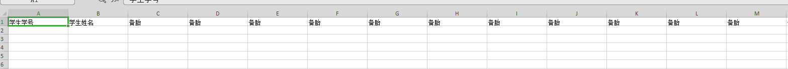
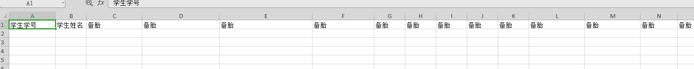
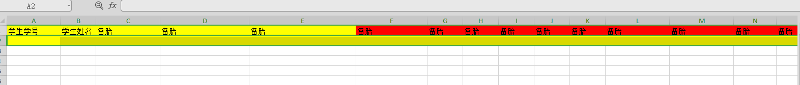
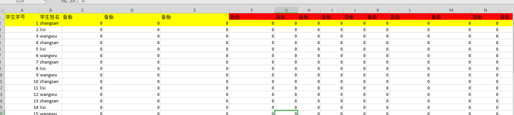

## 准备工作

[composer 安装依赖](https://packagist.org/packages/phpoffice/phpspreadsheet)

因为phpoffice/phpexcel停止维护
> This package is abandoned and no longer maintained. The author suggests using the phpoffice/phpspreadsheet package instead.

所以用PhpSpreadsheet
[github地址](https://github.com/PHPOffice/PhpSpreadsheet)

> 1 准备测试数据

    create database if not exists phpexec;

    use phpexec;

    create table if not exists student (
        id int primary key auto_increment,
        name varchar(32) not null default '',
        file1 int not null default 0,
        file2 int not null default 0,
        file3 int not null default 0,
        file4 int not null default 0,
        file5 int not null default 0,
        file6 int not null default 0,
        file7 int not null default 0,
        file8 int not null default 0,
        file9 int not null default 0,
        file10 int not null default 0,
        file11 int not null default 0,
        file12 int not null default 0,
        file13 int not null default 0,
        file14 int not null default 0,
        file15 int not null default 0,
        file16 int not null default 0,
        file17 int not null default 0,
        file18 int not null default 0,
        file19 int not null default 0,
        file20 int not null default 0,
        file21 int not null default 0,
        file22 int not null default 0,
        file23 int not null default 0,
        file24 int not null default 0,
        file25 int not null default 0,
        file26 int not null default 0,
        file27 int not null default 0,
        file28 int not null default 0,
        file29 int not null default 0
    );
    
    insert into student (name) values("zhangsan"),("lisi"),("wangwu");
    
    /** 先重复两次够用 **/
    insert into student (name) select name from student; 
    
    
### 导出

> 流程

1. 获取数据
2. 文件名
3. 表头
4. 内容
5. 导出到文件，并下载

> 表头的设置

效果 1-1

费时费力，而且重新插入新的列时，很麻烦

效果 1-2

就是这么方便

**本示例用效果1-2**

> 设置颜色 

效果2-1 

> 内容写入，导出

效果 3-1

完美...

### 导入    